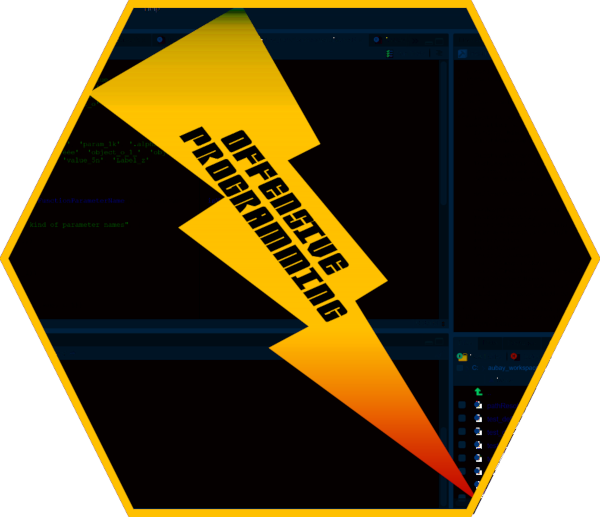
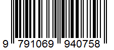

--- 
title: "Offensive Programming Book"
author: "Fabien GELINEAU <neonira@gmail.com>"
date: "2019-Q2"
site: bookdown::bookdown_site
cover-image: 'figures/op.png'
documentclass: book
bibliography: [book.bib, packages.bib]
biblio-style: apalike
link-citations: yes
description: "wyz.code.offensiveProgramming package related documentation"
output:
    html_document
---

```{r setup, include = FALSE}
knitr::opts_chunk$set(
  collapse = TRUE,
  comment = "#>"
)
```


# Welcome {-}

```{r figcover, echo = FALSE, out.width='80%', fig.asp=.75, fig.align='center'}

```

This is the website for “offensive programming”. This book will teach you how to put offensive programming in action with R.

This website is <cite class='comment'>and will remain</cite> free to use. It is licensed under the Creative Commons Attribution-NonCommercial-NoDerivs 3.0 License. 

## Book version {-}

This book version is 1.2.1. It relates to following (ref:R) package versions. 

(ref:R) package | version 
:-----------------------------|:--------
wyz.code.offensiveProgramming | 1.1.12
wyz.code.testthat | 1.1.9
wyz.code.metaTesting | 1.1.3
wyz.code.rdoc | 1.1.7


## Book production {-}

The book is written in [RMarkdown](https://rmarkdown.rstudio.com/) with [bookdown](https://bookdown.org/). You may get access to the [source](source) for contributions. The book is for the moment just resulting of my efforts. Hope it will be enhanced and result from a collaborative effort very soon. 

This book is identified by ISBN 979-10-699-4075-8. 



# Preamble {-}

Package (ref:PKN) aims to provide a strict type checking enforcement in (ref:R).

The (ref:R) language is a weakly typed script language. As such, it simplifies greatly program writing and allows for great flexibility.That's fine, and conceptually, there is no issue about that. 

Indeed, this leads more than desired to defensive programming practice. The absolute need to verify provided arguments, all along the function call chain, is very strong if you want to provide reliable and robust implementation. 

Consider following table about benefits of type control and type inference in lazy and strict type checking approaches. 

Goal | Lazy type control (standard (ref:R)) | Strict type checking
:----------------:|----------------------------------|:-------------------------------
type control | Weak type control implies coding of many contextual type controls | Strong type checking brings some rigidity
type inference | requires knowledge and navigation from code to doc (forth and back) is required | semantic naming allows more intuitive type inference

Won't it be nice to get the benefits of defensive programming and offensive programming, where ever and when ever needed?
 
The main objective of package (ref:PKN) is to allow strict type checking in (ref:R) to be as easy to use and to run as standard (ref:R)
